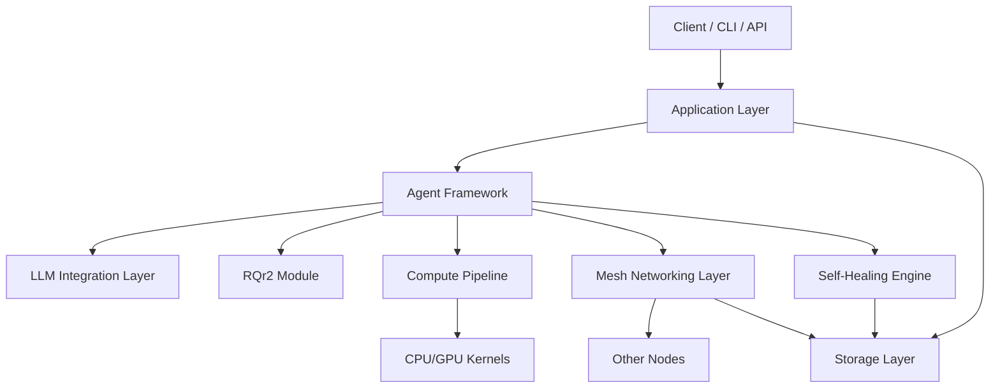
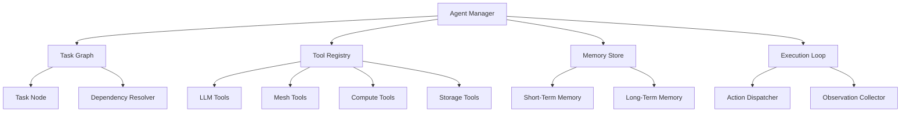
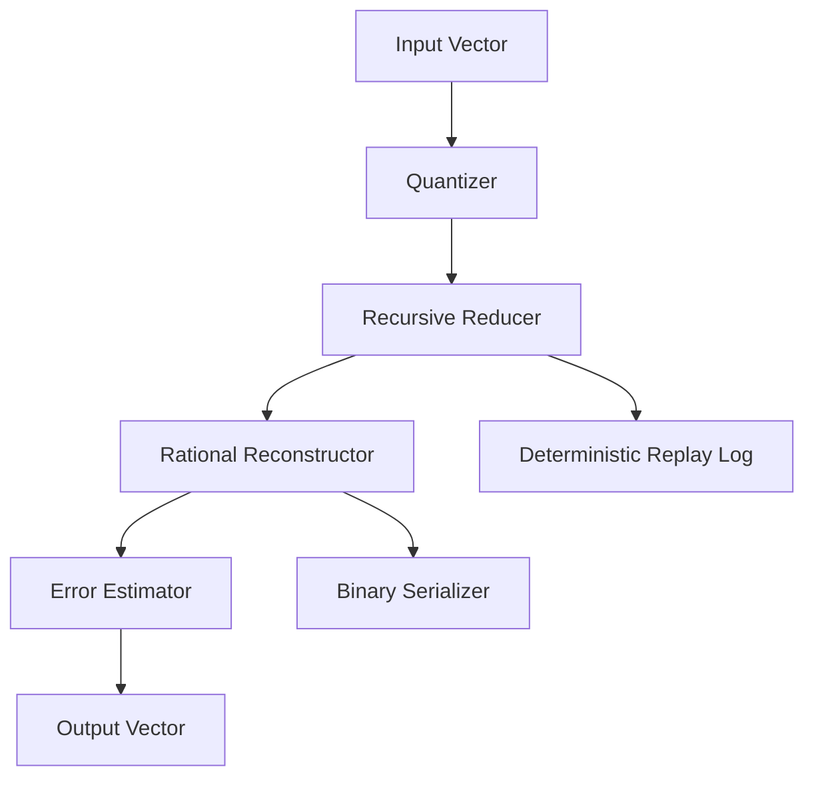
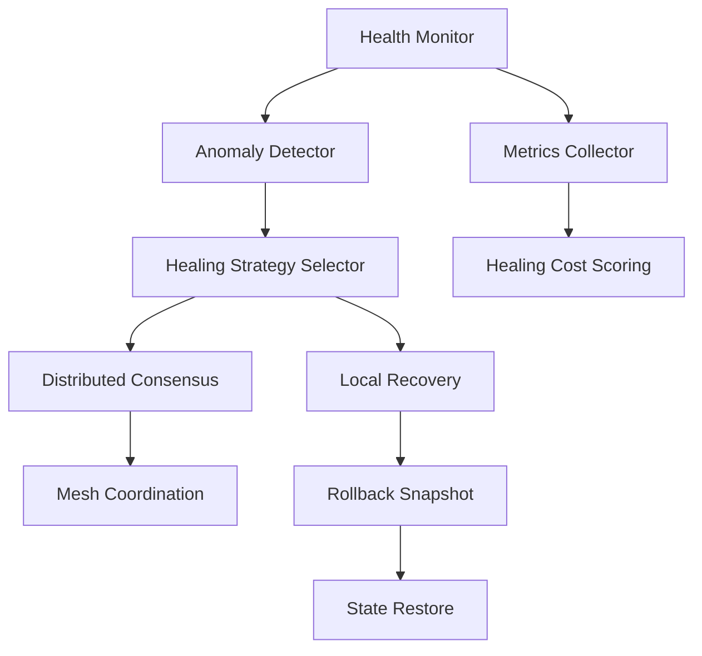
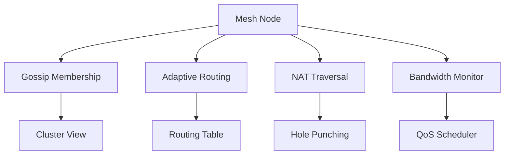
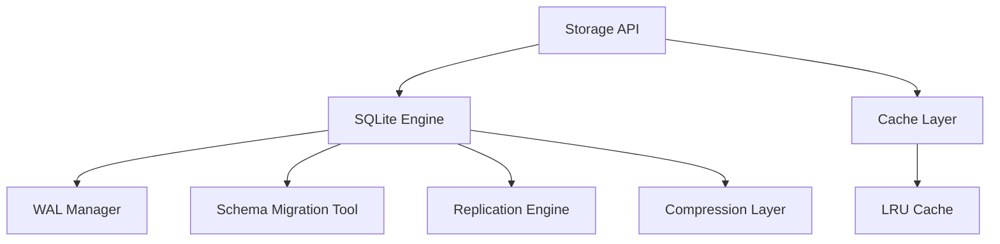
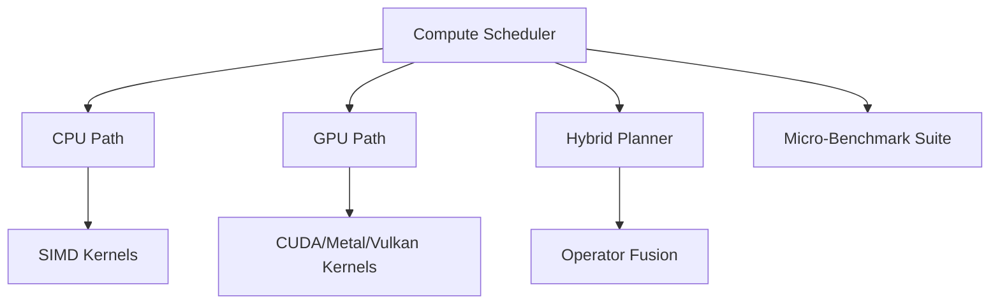
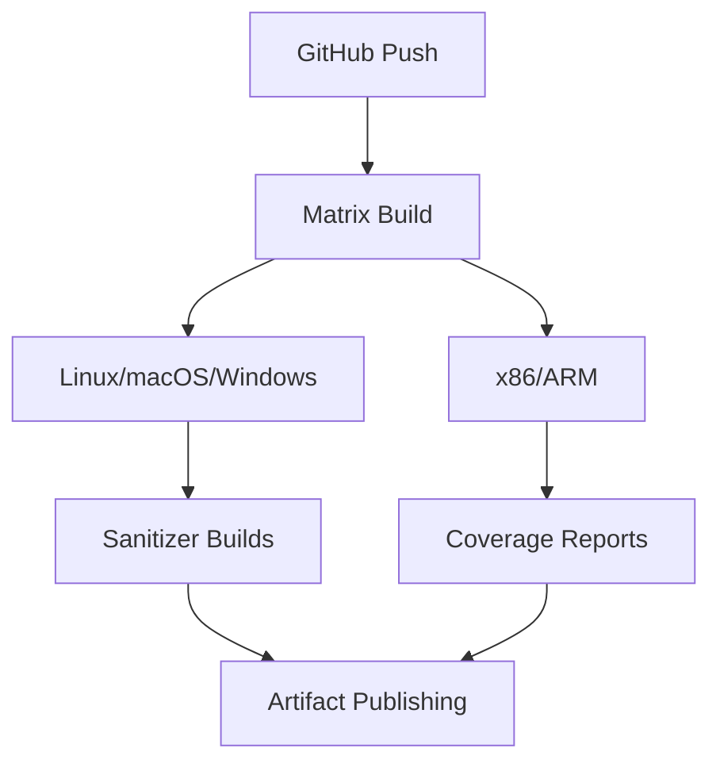

# Distributed Compute Mesh – Architecture Master File

This file is the **single source of truth** for GitHub Copilot Chat.

- It defines all modules, Mermaid diagrams, and intended modularization.
- Copilot Chat can read this file and:
  - Generate per-module docs under `docs/modules/`
  - Generate diagram files under `docs/diagrams/`
  - Scaffold C++ modules under `src/`
  - Wire up CI/CD and tests

> **Copilot Chat prompt example:**
> "Read `docs/ARCHITECTURE_MASTER.md` and create one `.md` file per module under `docs/modules/`, preserving diagrams and adding a short description for each."

---

## 0. Module index

| # | Module | Code location |
|---|---|---|
| 1 | Agent Framework | `src/agent/` |
| 2 | RQr2 Module | `src/rqr2/` |
| 3 | LLM Integration Layer | `src/llm/` |
| 4 | Self-Healing Engine | `src/healing/` |
| 5 | Mesh Networking Layer | `src/mesh/` |
| 6 | Storage Layer | `src/storage/` |
| 7 | Compute Pipeline | `src/compute/` |
| 8 | CI/CD Pipeline | `.github/workflows/`, `cmake/` |

---

## 1. System architecture overview

This diagram shows how all modules connect.



> **Copilot Chat prompt example:**
> "Generate `docs/diagrams/system-architecture.svg` from the first Mermaid diagram in `docs/ARCHITECTURE_MASTER.md`."

---

## 2. Agent framework

**Target code location:** `src/agent/`

**Responsibilities:**

- Manage agents, tasks, tools, and memory
- Execute task graphs
- Integrate with LLM, mesh, compute, and storage tools



**TODO:**
- [ ] `AgentManager` class — owns the registry, starts/stops agents
- [ ] `TaskGraph` + `TaskNode` — DAG scheduler with dependency resolution
- [ ] `ToolRegistry` — maps tool names to callable implementations
- [ ] `MemoryStore` — short-term (in-process map) and long-term (SQLite)
- [ ] `ExecutionLoop` — `tick()`-based dispatch, action/observation cycle

> **Copilot Chat prompt examples:**
> - "Create `src/agent/` with C++ classes matching the components in the Agent Framework diagram."
> - "Generate `docs/modules/agent-framework.md` from this section, including the Mermaid diagram and a short API sketch."

---

## 3. RQr2 module

**Target code location:** `src/rqr2/`

**Responsibilities:**

- Quantize input vectors
- Perform recursive reduction and rational reconstruction
- Provide deterministic replay and binary serialization



**TODO:**
- [ ] `Quantizer` — maps float vectors to integer grid
- [ ] `RecursiveReducer` — iterative rational approximation
- [ ] `RationalReconstructor` — inverse map back to float domain
- [ ] `ErrorEstimator` — L2 / Linf error bounds
- [ ] `ReplayLog` — deterministic journal for exact reconstruction
- [ ] `BinarySerializer` — compact wire format (little-endian, varint lengths)

> **Copilot Chat prompt examples:**
> - "Implement `src/rqr2/` in C++ with classes: `Quantizer`, `RecursiveReducer`, `RationalReconstructor`, `ErrorEstimator`, `ReplayLog`, `BinarySerializer`."
> - "Create unit tests for the RQr2 module under `tests/rqr2/` based on this diagram."

---

## 4. LLM integration layer

**Target code location:** `src/llm/`

**Responsibilities:**

- Route between local and remote models
- Provide embeddings and caching
- Support batching, streaming, and prompt templates

```mermaid
flowchart TD
    A[LLM Router] --> B[Local Model Client]
    A --> C[Remote API Client]
    A --> D[Embedding Engine]

    B --> E[Tokenizer]
    C --> F[HTTP Transport]
    D --> G[Vector Cache (SQLite)]

    A --> H[Prompt Template Registry]
    A --> I[Batching Engine]
    A --> J[Streaming Token Interface]
```

**TODO:**
- [ ] `LLMRouter` — selects local vs. remote based on `RUNE_LLM_URL`
- [ ] `LocalModelClient` — OpenAI-compat POST `/v1/chat/completions`
- [ ] `RemoteAPIClient` — same interface, different base URL
- [ ] `EmbeddingEngine` + `VectorCache` — SQLite-backed embedding store
- [ ] `PromptTemplateRegistry` — named templates with variable substitution
- [ ] `BatchingEngine` — coalesces requests within a time window
- [ ] `StreamingTokenInterface` — SSE / chunked-transfer token stream

> **Copilot Chat prompt examples:**
> - "Create `src/llm/` with a `Router` interface and implementations for local and remote clients."
> - "Generate `docs/modules/llm-integration.md` from this section."

---

## 5. Self-healing engine

**Target code location:** `src/healing/`

**Responsibilities:**

- Monitor health and detect anomalies
- Select and execute healing strategies
- Coordinate distributed healing and rollback



**TODO:**
- [ ] `HealthMonitor` — periodic metric sampling via `HeartAgent`
- [ ] `AnomalyDetector` — rule-based and statistical triggers
- [ ] `HealingStrategySelector` — cost-scored strategy ranking
- [ ] `LocalRecovery` — in-process repair (PRAGMA optimize, GC)
- [ ] `DistributedConsensus` — quorum-based repair across mesh peers
- [ ] `RollbackSnapshot` → `StateRestore` — SQLite checkpoint API
- [ ] `MetricsCollector` + `HealingCostScoring` — weighted health score

> **Copilot Chat prompt examples:**
> - "Implement `src/healing/` with components matching this diagram, including interfaces for anomaly detection and healing strategies."
> - "Create `docs/modules/self-healing-engine.md` from this section."

---

## 6. Mesh networking layer

**Target code location:** `src/mesh/`

**Responsibilities:**

- Maintain membership via gossip
- Provide adaptive routing
- Handle NAT traversal and bandwidth-aware scheduling



**TODO:**
- [ ] `MeshNode` — peer identity, connection lifecycle
- [ ] `GossipMembership` + `ClusterView` — SWIM-style failure detection
- [ ] `AdaptiveRouting` + `RoutingTable` — latency-aware next-hop selection
- [ ] `NATTraversal` + `HolePunching` — UDP hole punching with STUN
- [ ] `BandwidthMonitor` + `QoSScheduler` — token-bucket shaping

> **Copilot Chat prompt examples:**
> - "Create `src/mesh/` with C++ classes for gossip membership, routing, NAT traversal, and QoS scheduling."
> - "Generate `docs/modules/mesh-networking.md` from this section."

---

## 7. Storage layer

**Target code location:** `src/storage/`

**Responsibilities:**

- Provide a storage API over SQLite
- Manage WAL, replication, compression, and schema migrations
- Offer a cache layer



**TODO:**
- [ ] `StorageAPI` facade — unified CRUD over all tables
- [ ] `WALManager` — `PRAGMA journal_mode=WAL; synchronous=NORMAL`
- [ ] `SchemaMigrationTool` — version-stamped `CREATE TABLE IF NOT EXISTS`
- [ ] `ReplicationEngine` — SQLite page-level streaming to peers
- [ ] `CompressionLayer` — zstd frame around blob columns
- [ ] `CacheLayer` + `LRUCache` — in-process fixed-capacity cache

> **Copilot Chat prompt examples:**
> - "Implement `src/storage/` with a `StorageAPI` facade and underlying SQLite-based components."
> - "Create `docs/modules/storage-layer.md` from this section."

---

## 8. Compute pipeline

**Target code location:** `src/compute/`

**Responsibilities:**

- Schedule compute across CPU and GPU
- Plan hybrid execution and operator fusion
- Provide micro-benchmarks



**TODO:**
- [ ] `ComputeScheduler` — priority queue + work-stealing thread pool
- [ ] `CPUPath` + `SIMDKernels` — AVX2/NEON vectorized ops
- [ ] `GPUPath` — CUDA (Linux/Windows), Metal (macOS), Vulkan fallback
- [ ] `HybridPlanner` + `OperatorFusion` — DAG rewrite for fused kernels
- [ ] `MicroBenchmarkSuite` — Google Benchmark fixtures per kernel

> **Copilot Chat prompt examples:**
> - "Create `src/compute/` with a scheduler that can dispatch to CPU and GPU paths."
> - "Generate `docs/modules/compute-pipeline.md` from this section."

---

## 9. CI/CD pipeline

**Target locations:**

- GitHub Actions: `.github/workflows/`
- Build system: `cmake/`



**TODO:**
- [ ] `.github/workflows/ci.yml` — matrix: OS × arch, CMake + Ninja
- [ ] `.github/workflows/sanitizers.yml` — ASAN / UBSAN / TSAN builds
- [ ] `.github/workflows/coverage.yml` — gcov + lcov, upload to Codecov
- [ ] `.github/workflows/release.yml` — tag-triggered container publish
- [ ] `cmake/Sanitizers.cmake` — reusable CMake include for sanitizer flags
- [ ] `cmake/Coverage.cmake` — reusable CMake include for coverage flags

> **Copilot Chat prompt examples:**
> - "Create GitHub Actions workflows under `.github/workflows/` implementing the CI/CD pipeline described in the last diagram."
> - "Add sanitizer and coverage builds for all modules."

---

## 10. Suggested Copilot Chat workflows

Paste these prompts directly into GitHub Copilot Chat inside this repository.

### 10.1 Generate per-module docs

> "Read `docs/ARCHITECTURE_MASTER.md` and create one `.md` file per module under `docs/modules/`, preserving the relevant Mermaid diagram and adding a short description and TODO list for each module."

### 10.2 Generate diagrams as SVG/PNG

> "For every Mermaid diagram in `docs/ARCHITECTURE_MASTER.md`, generate an SVG file under `docs/diagrams/` with a matching name (e.g. `system-architecture.svg`, `agent-framework.svg`, …)."

### 10.3 Scaffold C++ modules

> "Using `docs/ARCHITECTURE_MASTER.md` as the specification, scaffold C++ code under `src/` for each module, with headers, source files, and minimal CMake `add_library()` integration."

### 10.4 Create tests

> "Create a `tests/` tree with unit tests for each module described in `docs/ARCHITECTURE_MASTER.md`, using GoogleTest and matching the class names in each diagram."

### 10.5 Wire CI/CD

> "Generate complete GitHub Actions workflow files under `.github/workflows/` that implement the CI/CD pipeline in section 9 of `docs/ARCHITECTURE_MASTER.md`, covering Linux/macOS/Windows × x86/ARM with sanitizer and coverage jobs."

---

*This single file is designed so GitHub Copilot Chat can modularize from it: docs, diagrams, code, and CI/CD.*
