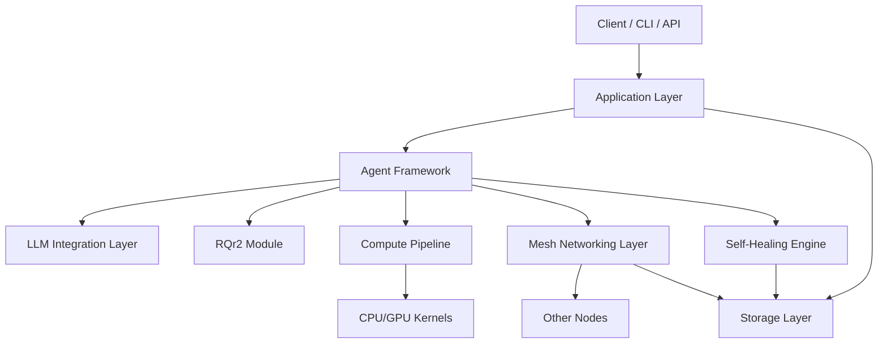

# System Architecture Overview

End-to-end view of the QRrune / QFS stack. The **Application Layer** is the
single entry point for clients, CLIs, and REST callers. It fans out to the
**Agent Framework**, which in turn drives every subsystem: LLM inference, the
RQr2 encoding engine, the compute pipeline, self-healing, and mesh networking.
Persistent state flows down to the **Storage Layer** from multiple directions.

## Component Responsibilities

| Component | Role |
|---|---|
| Application Layer | REST API gateway, CLI dispatcher, web UI |
| Agent Framework | Orchestrates all cognitive agents; owns the EventBus |
| LLM Integration Layer | Local + remote model routing, embeddings, prompt templates |
| RQr2 Module | 14-dimensional symbol encoding / decoding |
| Compute Pipeline | CPU/GPU task scheduling and resource allocation |
| Self-Healing Engine | Integrity checks, auto-recovery, unburdening rituals |
| Mesh Networking Layer | Yggdrasil overlay, peer discovery, gossip routing |
| Storage Layer | SQLite WAL, symbol store, audit log, memory substrate |

## Related diagrams

- [Agent Framework](02-agent-framework.md)
- [LLM Integration](04-llm-integration.md)
- [Self-Healing Engine](05-self-healing.md)
- [Mesh Networking](06-mesh-networking.md)
- [Storage Layer](07-storage.md)
- [Compute Pipeline](08-compute-pipeline.md)
