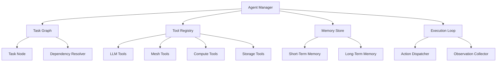

# Agent Framework Architecture

The **Agent Manager** is the central coordinator. It holds the task graph,
tool registry, memory store, and execution loop. All cognitive agents
(`ChatAgent`, `WalletAgent`, `NodeAgent`, `TorrentAgent`, `EdgeAgent`,
`OverwatchAgent`, `LibrarianAgent`, `HousekeepingAgent`, `StrategyAgent`,
`EpicRuneAgent`, `LoadSimulatorAgent`) are launched from `brain_main.cpp` and
communicate through the shared **EventBus**.

## Agent catalogue

| Agent | Type | Tick interval | Key event types |
|---|---|---|---|
| HeartAgent | heartbeat | 5 000 ms | `heartbeat` |
| WorkerAgent | worker | 100 / 1 000 ms | `chat_request`, `wallet_sign`, `rune_trust` |
| GCAgent | gc | 30 000 ms | `gc_complete` |
| RuneTrustManager | trust | 10 000 ms | `trust_cycle` |
| RuneFusionEngine | fusion | 20 000 ms | `fusion_cycle` |
| ChatAgent | chat | 2 000 ms | `chat_route` → `chat_response` |
| WalletAgent | wallet | 3 000 ms | `wallet_sign` / `wallet_verify` |
| NodeAgent | node | 10 000 ms | `node_healthy` / `node_unreachable` |
| TorrentAgent | torrent | 30 000 ms | `torrent_piece` → `torrent_piece_stored` |
| EdgeAgent | edge | 10 000 ms | `edge_task` → `edge_result` |
| HousekeepingAgent | housekeeping | 30 000 ms | `housekeeping_cycle` |
| StrategyAgent | strategy | 30 000 ms | `strategy_inferred` |
| EpicRuneAgent | epic | 60 000 ms | `epic_rune_born` |
| OverwatchAgent | overwatch | 15 000 ms | `overwatch_alert` / `overwatch_report` |
| LibrarianAgent | librarian | 20 000 ms | `symbol_classified` / `catalog_updated` |
| LoadSimulatorAgent | loadsim | 10 000 ms | `load_sim_tick` |

## Extension guide

1. Subclass `AgentBase` and override `tick()`.
2. Register with `BrainDb::register_agent()` in `brain_main.cpp`.
3. Enqueue async work via `BrainDb::enqueue_event()`; `WorkerAgent` picks it up.
4. Emit user-visible events via `AgentBase::emit()` → `EventBus`.
5. Look for `// EXTEND:` markers in `brain_system.hpp`.

## Related diagrams

- [System Overview](01-system-overview.md)
- [LLM Integration](04-llm-integration.md)
- [Storage Layer](07-storage.md)
