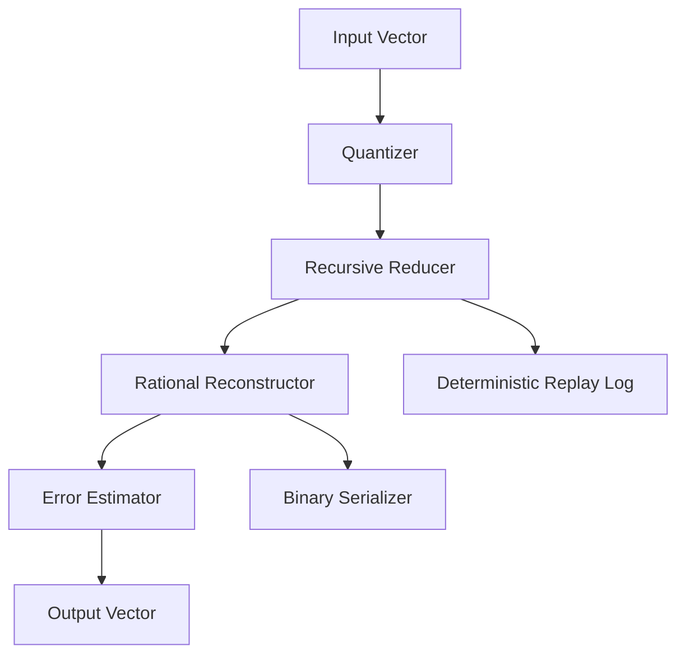

# RQr2 Module — Recursive Quantized Rational Reconstruction

The **RQr2 Module** encodes arbitrary input vectors into the 14-dimensional
QRrune symbol space. Each stage is deterministic and invertible, enabling
lossless reconstruction and deterministic replay.

## The 14 dimensions

| # | Dimension | Type | Description |
|---|---|---|---|
| 1 | `radical` | TEXT | Root linguistic / categorical classifier |
| 2 | `layer` | TEXT | Encoding layer (`OLD_NORSE`, `CJK`, `SYNTHETIC`, …) |
| 3 | `sem_x` | REAL | Semantic embedding — X axis |
| 4 | `sem_y` | REAL | Semantic embedding — Y axis |
| 5 | `sem_z` | REAL | Semantic embedding — Z axis |
| 6 | `color_h` | REAL | HSB hue [0, 360) |
| 7 | `color_s` | REAL | HSB saturation [0, 1] |
| 8 | `color_b` | REAL | HSB brightness [0, 1] |
| 9 | `temporal_phase` | REAL | Temporal / cyclic phase offset |
| 10 | `affinity_mask` | INT | Bitmask of agent-affinity flags |
| 11 | `mutation_index` | INT | Cumulative mutation count |
| 12 | `stroke_count` | INT | Source glyph stroke complexity |
| 13 | `fractal_depth` | INT | Recursive encoding depth |
| 14 | `compression_q` | TEXT | Compression quality (`LOSSLESS`, `LOSSY_HQ`, …) |

## Storage

Symbols are persisted in the `symbols` table (brain DB) via
`BrainDb::insert_symbol()` and retrieved via `BrainDb::symbol_by_id()` or
the multi-filter `BrainDb::symbols_query()`.

REST endpoints:

| Method | Path | Operation |
|---|---|---|
| `POST` | `/brain/symbols` | Store a 14D symbol |
| `GET` | `/brain/symbols?radical=&layer=&limit=` | Query symbols |
| `POST` | `/brain/classify` | Enqueue a `classify_symbol` event |

## Related diagrams

- [System Overview](01-system-overview.md)
- [Agent Framework](02-agent-framework.md)
- [Storage Layer](07-storage.md)
