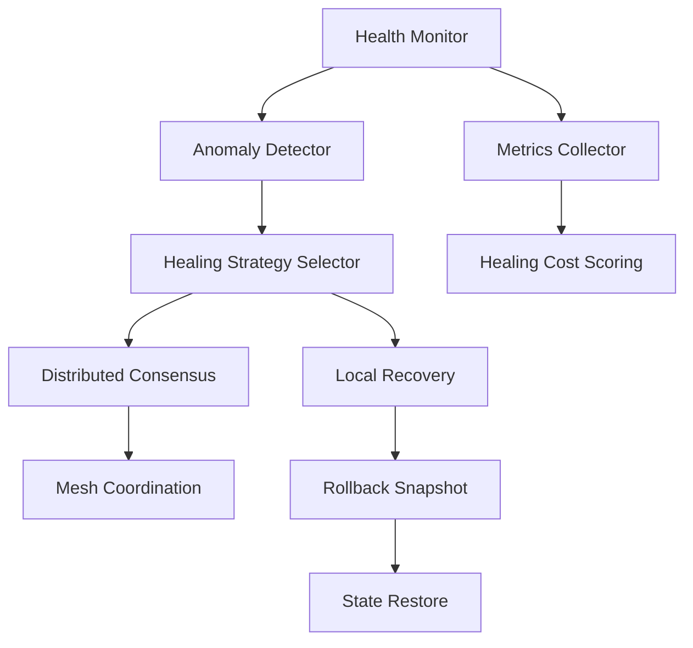

# Self-Healing Engine

The **Self-Healing Engine** continuously monitors system health, detects
anomalies, selects a recovery strategy, and — where possible — repairs state
without human intervention. It maps directly to the §19 Healing Module API.

## Agent mapping

| Diagram node | Implementation |
|---|---|
| Health Monitor | `OverwatchAgent` (EventBus subscriber) |
| Anomaly Detector | `OverwatchAgent::tick()` — gc_kill_rate + event_flood checks |
| Metrics Collector | `HeartAgent` — emits `heartbeat` with `AllCounts` |
| Healing Strategy Selector | `OverwatchAgent` — emits `overwatch_alert` with suggested action |
| Local Recovery | `HousekeepingAgent` — PRAGMA optimize, audit archival |
| Rollback Snapshot | `BrainDb::save_checkpoint()` |
| State Restore | `BrainDb::load_checkpoint()` |

## Anomaly detection rules (current)

| Anomaly | Trigger | Action |
|---|---|---|
| `gc_kill_rate` | GC quarantined > 5 runes in one window | Emit `overwatch_alert` |
| `unknown_event_flood` | > 20 `worker_unknown` events in one window | Emit `overwatch_alert` |

## Healing API (§19)

| Method | Maps to |
|---|---|
| `run_full_check()` | `OverwatchAgent::tick()` health report every 4 ticks |
| `health_score()` | Derived from `AllCounts`: quarantined / total runes ratio |
| `auto_repair()` | `HousekeepingAgent` — GC, PRAGMA optimize |
| `execute_unburdening()` | `HousekeepingAgent::archive_old_audit()` |
| `save_checkpoint()` | `BrainDb::save_checkpoint(agent_name, state)` |
| `load_checkpoint()` | `BrainDb::load_checkpoint(agent_name, id)` |

## Related diagrams

- [System Overview](01-system-overview.md)
- [Agent Framework](02-agent-framework.md)
- [Storage Layer](07-storage.md)
