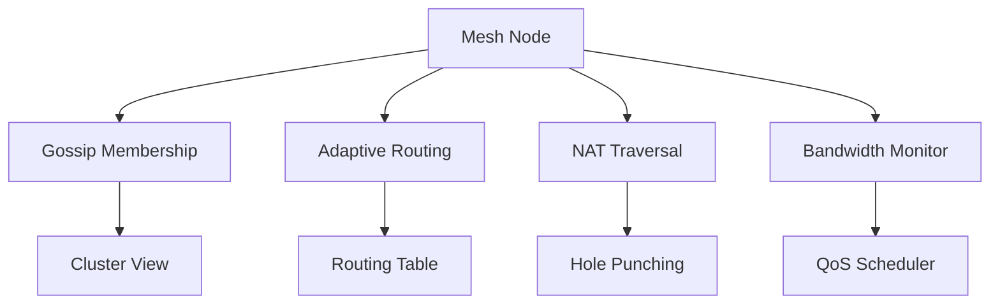

# Mesh Networking Layer

The **Mesh Networking Layer** implements peer-to-peer communication across
QRrune nodes. It provides gossip-based membership, adaptive routing, NAT
traversal, and QoS scheduling. It maps to the §18 Mesh Module API.



## NodeAgent — health polling

`NodeAgent` (tick: 10 000 ms) implements the live side of the mesh:

1. Reads all non-local peers from `BrainDb::nodes_list()`.
2. HTTP GET `/brain/health` on each peer (3 s connect, 5 s read timeout).
3. **Reachable**: `record_trust(node_id, "node", +0.01, "health_check_ok")`;
   emit `node_healthy`.
4. **Unreachable**: `record_trust(node_id, "node", −0.05, "health_check_failed")`;
   upsert status `unreachable`; emit `node_unreachable`.

## TorrentAgent — piece replication

`TorrentAgent` (tick: 30 000 ms) tracks distributed data chunks:

- Processes `torrent_piece` events from the work queue.
- Stores each piece as an artifact with a **7-day TTL**.
- Emits `torrent_piece_stored` per piece and `torrent_status` every 6 ticks (~3 min).

## Adding a peer

To register a new peer node at runtime:

```bash
curl -X POST http://localhost:7071/brain/events \
  -H 'Content-Type: application/json' \
  -d '{"source":"cli","event_type":"node_add",
       "payload":{"node_id":"peer-01","host":"192.168.1.42","port":7071}}'
```

## Mesh API (§18)

| §18 method | Maps to |
|---|---|
| `join_mesh()` | `nodes` table upsert + `NodeAgent` discovery |
| `send_message()` | `BrainDb::enqueue_event()` + NodeAgent delivery |
| `broadcast()` | `NodeAgent` iterates all peers |
| `route_by_capability()` | `BrainDb::nodes_list()` + capability filter |

## Related diagrams

- [System Overview](01-system-overview.md)
- [Agent Framework](02-agent-framework.md)
