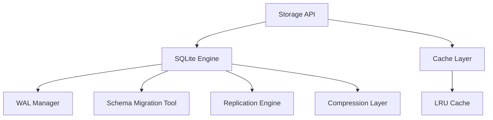

# Storage Layer

All persistent state in QRrune uses **SQLite in WAL mode** with
`synchronous=NORMAL`, a 40 MB page cache, and `temp_store=MEMORY`. The storage
layer maps to the §21 Storage Module API.



## Tables

| Table | Purpose | Key columns |
|---|---|---|
| `nodes` | Peer registry | `node_id`, `status`, `trust`, `last_seen` |
| `agents` | Agent registry | `name`, `type`, `status`, `tick_count`, `error_count` |
| `runes` | Elder/Extended Futhark rune corpus | `name`, `glyph`, `category`, `trust`, `level`, `usage_count` |
| `strategies` | Strategy rune definitions | `name`, `rune_ids`, `priority` |
| `fusion_log` | Pairwise rune fusions | `input_a`, `input_b`, `output_name`, `score` |
| `artifacts` | Ephemeral binary/JSON blobs with TTL | `type`, `source`, `payload`, `expires_at` |
| `audit` | Immutable append-only event ledger | `agent`, `action`, `subject`, `detail` |
| `node_events` | Async work queue | `event_type`, `payload`, `priority`, `processed` |
| `trust_ledger` | Per-subject trust deltas | `subject`, `subject_type`, `delta`, `reason` |
| `size_assessment` | Table-growth snapshots | `snapshot_at`, counts per table |
| `symbols` | 14D QFS symbol objects | `radical`, `layer`, `sem_*`, `color_*`, … |
| `knowledge` | MemorySubstrate entries | `radical`, `layer`, `entry`, `sem_*` |
| `agent_checkpoints` | Agent recovery snapshots | `agent_name`, `state`, `created_at` |

## BrainDb public API (selected)

```
// Symbol store
insert_symbol(doc)          → int
symbol_by_id(id)            → json
symbols_query(radical, layer, limit) → json

// Knowledge substrate
store_knowledge(radical, layer, entry) → int
query_knowledge(radical, limit)        → json

// Checkpoints
save_checkpoint(agent_name, state) → int
load_checkpoint(agent_name, id)    → json

// Audit
audit_log(agent, action, subject, detail)
archive_old_audit(days_old)        → int  // HousekeepingAgent

// Agents
all_agents()                        → json
register_agent(name, type)
update_agent_tick(name)
update_agent_status(name, status)
```

## Storage API endpoints

| Method | Path | Description |
|---|---|---|
| `GET` | `/brain/symbols` | Query 14D symbols by radical/layer |
| `POST` | `/brain/symbols` | Store a 14D symbol |
| `POST` | `/brain/classify` | Enqueue classify_symbol event |
| `GET` | `/brain/knowledge` | Query knowledge substrate by radical |
| `GET` | `/brain/agents` | List all agents with status |

## Related diagrams

- [System Overview](01-system-overview.md)
- [RQr2 Module](03-rqr2-module.md)
- [Self-Healing Engine](05-self-healing.md)
