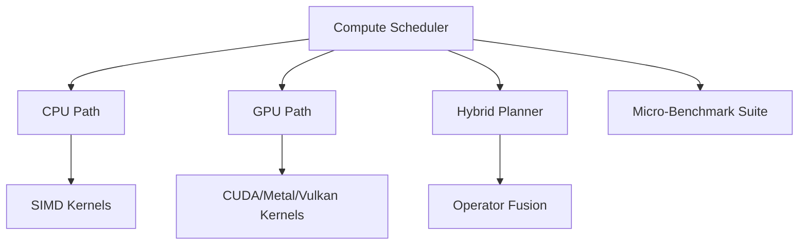

# Compute Pipeline

The **Compute Pipeline** schedules and executes CPU and GPU workloads. It maps
to the §20 Compute Module API. The **Hybrid Planner** balances work between
CPU (SIMD kernels) and GPU (CUDA / Metal / Vulkan), with operator fusion to
reduce memory round-trips.

## Task lifecycle

1. Agent (or REST client) submits a `Task` → `BrainDb::enqueue_event()`.
2. `WorkerAgent` dequeues events by priority (highest first, FIFO within same
   priority).
3. `WorkerAgent` dispatches to the appropriate handler branch
   (`strategy_execute`, `rune_trust`, etc.).
4. Completed tasks are marked `processed=1` via `BrainDb::mark_processed()`.

## EdgeAgent — low-latency compute

`EdgeAgent` (tick: 10 000 ms) handles `edge_task` events:

| `task_type` | Action |
|---|---|
| `hash` | FNV-1a 64-bit hash of `data_hex` |
| `qr_detect` | QR code detection scaffold (returns `detected: false`; wire in a QR lib to activate) |

Results are emitted as `edge_result` events for real-time visualisation layers.

## Profiling

The `size_assessment` table records row-count snapshots every 12 `HeartAgent`
ticks (~1 min). Use `GET /brain/status` to retrieve the latest snapshot.

## Compute API (§20)

| §20 method | Maps to |
|---|---|
| `submit(Task)` | `BrainDb::enqueue_event()` |
| `cancel(TaskId)` | `BrainDb::mark_processed(id)` with `cancelled` payload |
| `get_status(TaskId)` | Query `node_events WHERE id=?` |
| `queue_depth(class)` | `AllCounts::pending_events` |
| `utilization()` | `HeartAgent` heartbeat payload |

## Related diagrams

- [System Overview](01-system-overview.md)
- [Agent Framework](02-agent-framework.md)
- [Storage Layer](07-storage.md)
