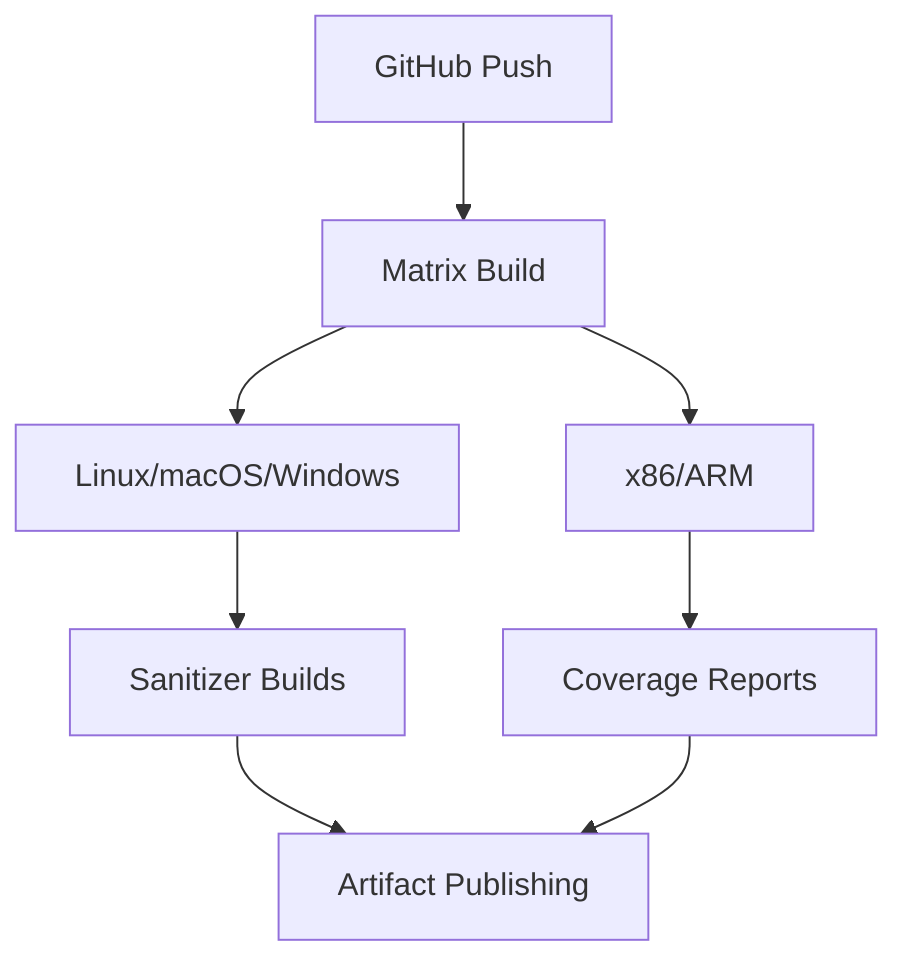

# CI/CD Pipeline

Every push and pull request triggers a GitHub Actions matrix build. Version
tags (`v*.*.*`) additionally trigger the CD pipeline that publishes release
containers and a GitHub Release.



## CI stages

| # | Stage | Tool | Failure policy |
|---|---|---|---|
| 1 | Lint | `clang-format`, `clang-tidy` | Block merge on any violation |
| 2 | Build | CMake + Ninja matrix | Block merge on build failure |
| 3 | Test | ctest (`--output-on-failure`) | Block merge below 80 % coverage |
| 4 | Integration | Docker Compose full stack, end-to-end API tests | Block merge on any failure |

## Build recipe

```bash
cd rune-backend
cmake -S . -B build -G Ninja -DCMAKE_BUILD_TYPE=Release
cmake --build build --parallel
```

Produces:
- `build/rune` — node server on `:7070`
- `build/rune_brain` — cognitive node on `:7071`

All C++ dependencies are fetched automatically via CMake `FetchContent`:

| Dependency | Version | Source |
|---|---|---|
| Monocypher | 3.1.3 | `FetchContent` |
| cpp-httplib | v0.15.3 | `FetchContent` |
| nlohmann/json | v3.11.3 | `FetchContent` |
| SQLite3 | system | `find_package(SQLite3 REQUIRED)` |

## CD pipeline (on `v*.*.*` tags)

1. Build release containers with `-O3 -DNDEBUG`.
2. Run full test suite (unit + integration + system).
3. Tag container images `:VERSION` and `:latest`.
4. Create GitHub Release with changelog and binary artifacts.

## Related diagrams

- [System Overview](01-system-overview.md)
